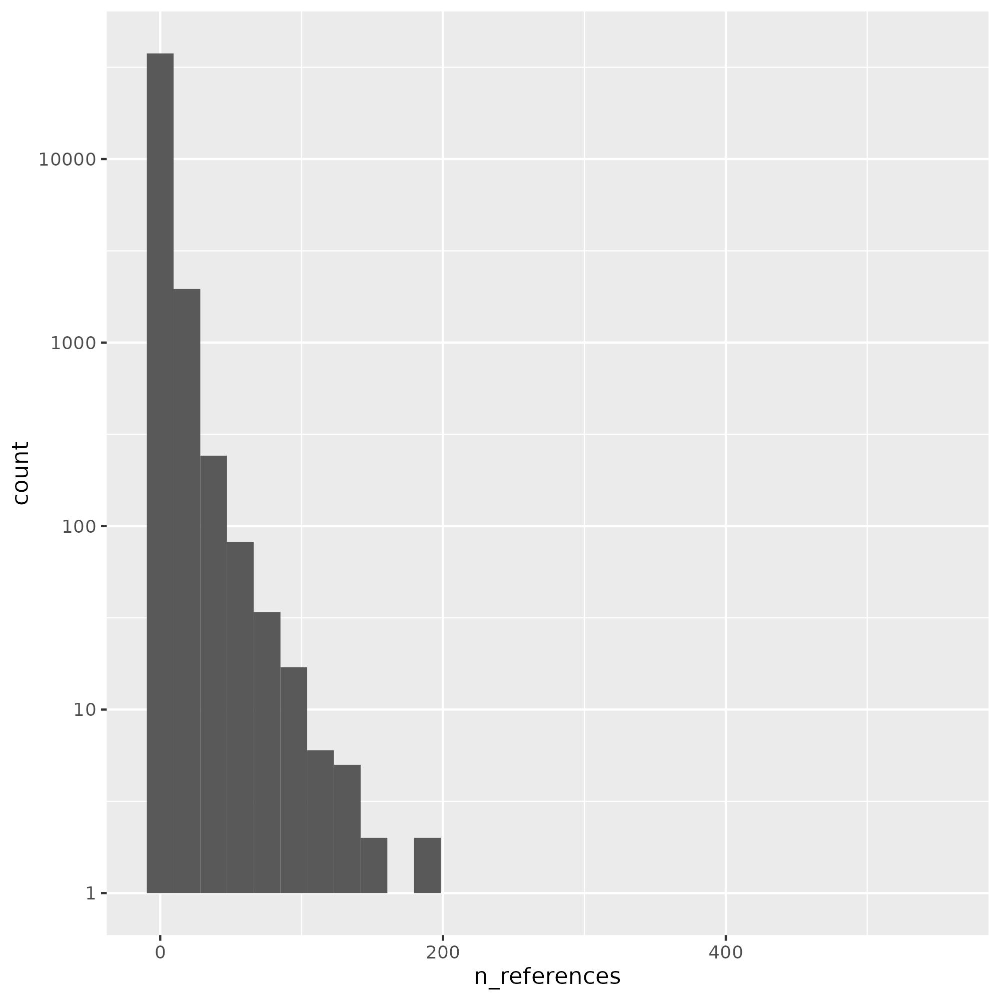

Part 1 - NicheNet
=================

In ligand_target_matrix each row of the matrix corresponds to a specific target gene, and each column corresponds to a specific ligand. The entries in the matrix reflect the strength of the relationship between each ligand and target gene. This is represented by a score.

```ligand_target_matrix["SPTB",]``` outputs that ```CIRBP``` ligand has a score of 0.002955. There is no direct relation with each other in the submitted DBs/networks such as L_R, lr_sig, gr.  However, we see that in their gr_network SPTB gene is regulated by several genes, namely GATA1,GATA2, TAL1. And these genes are signaled by MAPK3 in their lr_sig (PPI) network. Finally, in their network MAPK3 is linked to CIRBP.  

**Optimization**

analyzing the gene expression patterns in response to different ligands to identify the target genes that are most significantly regulated by each ligand. they validate they are output by comparing to gene expression data from cells that have been treated with different ligands.

In simple words, they utilize publicly available dataset of known intercellular communication networks.

There is a bias in this approach and they mention this in their Sup.Note_4 such as populatiry bias (well studied ligands, cytokines/growth factors over less-studied ligands).

They have also noted:

A next main limitation of this validation approach is that the response to extracellular signals depends
on cell type and state. This context-specificity is not taken into account in the general model of
NicheNet.

Part 2 - Omni-Nnet
================

It performs a differential expression analysis to compare:

- Human lung epithelial cells (NHBE): mock treated vs infected with SARS-CoV-2.

- A549 alveolar cancer cell line: mock treated vs infected with SARS-CoV-2.

- Calu-3 human lung epithelial cancer cell line: mock treated vs infected with SARS-CoV-2.


**Overall Design**

Check the link: <https://www.ncbi.nlm.nih.gov/geo/query/acc.cgi?acc=GSE147507>

1) ***Independent biological triplicates of primary human lung epithelium (NHBE) that were mock treated or infected with SARS-CoV-2 (USA-WA1/2020)**, IAV (A/Puerto Rico/8/1934 (H1N1)), an IAV that lacks the NS1 protein (IAVdNS1) and treated with human interferon-beta.*
2) *Independent biological triplicates of transformed lung alveolar (A549) cells that were mock treated or infected with SARS-CoV-2 (USA-WA1/2020), RSV (A2 strain) or IAV (A/Puerto Rico/8/1934 (H1N1)).*
3) Independent biological triplicates of transformed lung alveolar (A549) transduced with a vector expressing human ACE2, that were also mock treated or infected with SARS-CoV-2 (USA-WA1/2020) with or without Ruxolitinib pre-treatment (500 nM).
4) *Transformed lung-derived Calu-3 cells that were mock treated or infected with SARS-CoV-2 (USA-WA1/2020).*
5) Ferrets that were infected intranasally with 105 PFU of influenza A/California/04/2009 (pH1N1) virus and nasal washes were collected from anesthetized ferrets on day 7 post infection.
6) More ferrets
7) COVID19 patient samples: Uninfected human lung biopsies were derived from one male (age 72) and one female (age 60) and used as biological replicates. Additionally, lung samples derived from a single male COVID19 deceased patient (age 74) were processed in technical replicates.

## How does OmniPath build the network

They use lig-rec DB of OmniPath (more on this later).

Prediction & signaling: they import interactions from all post-translational datasets of OmniPath. The datasets are "omnipath", "kinaseextra", "pathwayextra" and ~~"ligrecextra".~~ 

DataSetSize=80,237 edges.

After that they use communication role annotation DB. 
- Filter the category to ligand and receptor in the annotation. (transmembrane,transmembrane_phobius, growth_hormone,laminin,secreted).
- They break down complexes into individual genes, annotating all the componenets of the complex as it is.
- Seperate Ligands and Receptors. 
- They match these through interactionDB (that is imported) if any of the pairs are matching. 
- The matching pairs are merged with the lig-rec DB. 
- The rest goes as signaling network.


Part 3 - OmniPathR
================

## Functions

```import_ligrecextra_interactions```

link: to documentation <https://r.omnipathdb.org/reference/import_ligrecextra_interactions.html>

contains ligand-receptor interactions without literature reference. The ligand-receptor interactions supported by literature references are part of the `omnipath` dataset.

::: warning
*this is the dataset that they used with NNet.*

They do not deal with complexes at this stage but in PPI (prediction of LRs)
:::


```
interactions <- import_ligrecextra_interactions(
    resources = c('HPRD', 'Guide2Pharma'),
    organism = 9606
)

```
Default params(without filtering resources) has 8350 edges. The table includes columns as follows. 

'source' 'target' 'source_genesymbol' 'target_genesymbol' 'is_directed' 'is_stimulation' 'is_inhibition' 'consensus_direction' 'consensus_stimulation' 'consensus_inhibition' 'sources' 'references' 'curation_effort' 'n_references' 'n_resources'

*The consensus score is the number of resources supporting the classification of an entity into a category based on combined information of many resources.

<span style="color:red">I do not undertand how it can have sources but no references.</span>

| sources                                                         | ref | cur_effort | n_ref | n_source |
|-----------------------------------------------------------------|-----|------------|-------|----------|
|      Baccin2019;CellCall;PhosphoPoint;Ramilowski2015_Baccin2019 | NA  | 0          | 0     | 3        |
| Baccin2019;CellCall;PhosphoPoint;Ramilowski2015_Baccin2019;Wang | NA  | 0          | 0     | 4        |
|                                                                 |     |            |       |          |

******************************

```import_omnipath_interactions``` contains only interactions supported by literature references. This part of the interaction database compiled a similar way as it has been presented in the first paper describing OmniPath (Turei et al. 2016). **[literature-curated human signaling interactions]**

Default params has 40014 edges. 


```import_omnipath_intercell``` Imports the OmniPath intercellular **communication role annotation** database. It provides information on the roles in inter-cellular signaling. E.g. if a protein is a ligand, a receptor, an extracellular matrix (ECM) component, etc.

### Approach 1: 

- import omnipath interactions that contains only literature supported PPIs.
- import intercell annotations and filter them by parent category (ligand or receptor)
- filter the interactions based on these annotations. 
    - filter the interaction if its annotated as ligand or receptor which results in 14117 unique edges.
    - seperating ligand and receptor, and cheking if source is ligand while target is receptor. results in 4312 unique edges.

**Issues:**  
        
- Does not deal with Complexes. These are discarded/skipped right away. We are doing a string check if L1/L1_UniProt is in list of ligands annotation, and for complexes the string goes as L1_L2. Unless the whole complex is annotated as ligand or receptor. 
- It is documented that import_omnipath_interactions contains only PPI interactions that is supported by literature. However, when I plot the distribution of n_refrences. I see there are edges with no ref.

- A gene might/is be annotated as ligand in one resource while as a receptor in other. (#2713 genes annotated as both ways)

#### Resolving issues in Approach 1. 

We start with fixing the annotation table by discarding any annotation that is annotated at least 6 times in that category. ```consensus_score>5```


```edges(not separated as L-R``` drops to #3760 while other one drops to 2,723.

**NOTE:** Complex mol issue is not resolved in this approach. Meaning it does not have any complex. Unless the whole complex is annotated as L/R. In this case its always one mol. i.e: COMPLEX:P00738


### Approach 2: 

```import_ligrecextra_interactions```

has 8350 edges. drops to 6825 after filtering (n_ref > 0). this has 879 complexes. 

Apparently, there are some of them does not exist in the annotation table (```import_omnipath_intercell```) which is the communication role annotation database. Which we can not go and check if the shit isnt annotated as L/R. Great!!

Ohhh, its because we limit the annotation table to ligand/receptor ones. And in their ligrecextra, they have edges that are adhesion/secreted. Noice!

#### Resolving issue in Approach 2. 

TBC

